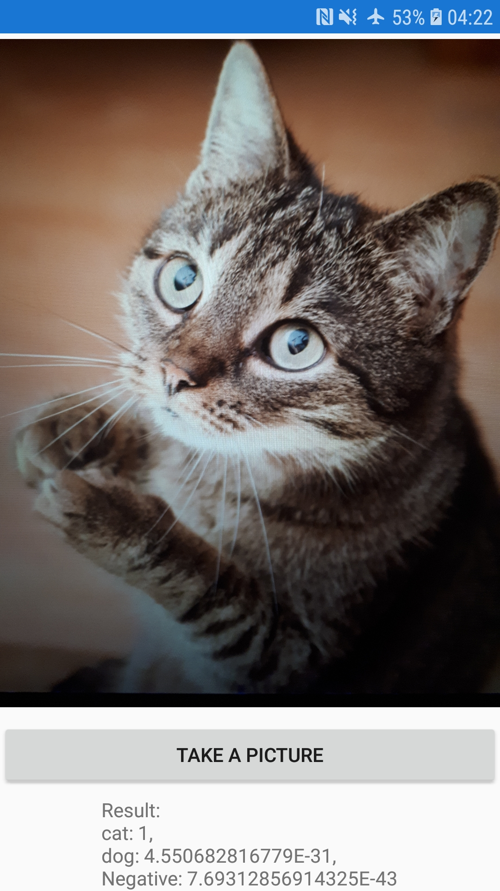

Demo using [
Xam.Plugins.OnDeviceCustomVision](https://www.nuget.org/packages/Xam.Plugins.OnDeviceCustomVision/) and [customvision.ai](http://customvision.ai) produced AI model to do offline "Cat or Dog" recoginition.

| Android  | iOS   |
| ----- |-----:|
| Tensorflow Lite | CoreML |
|||